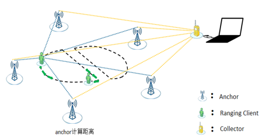
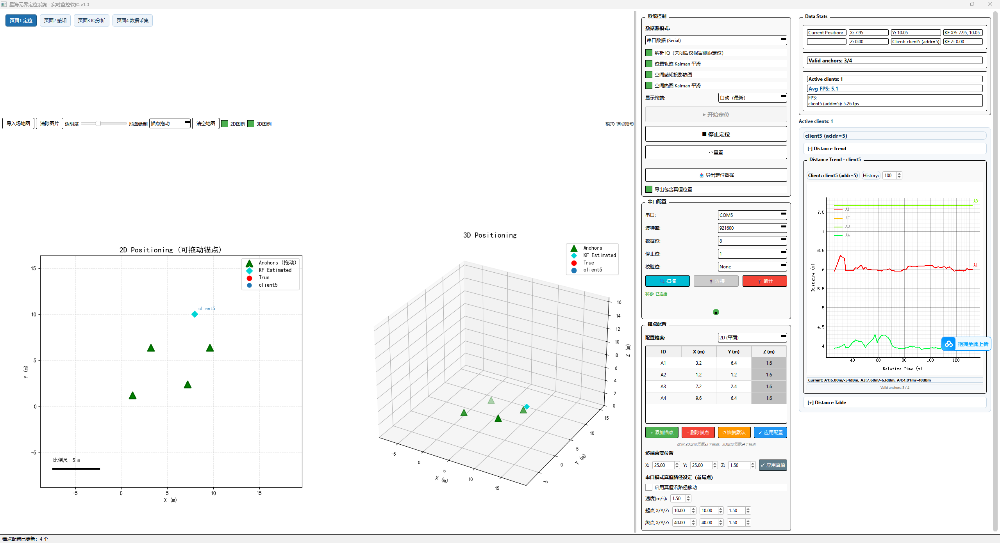
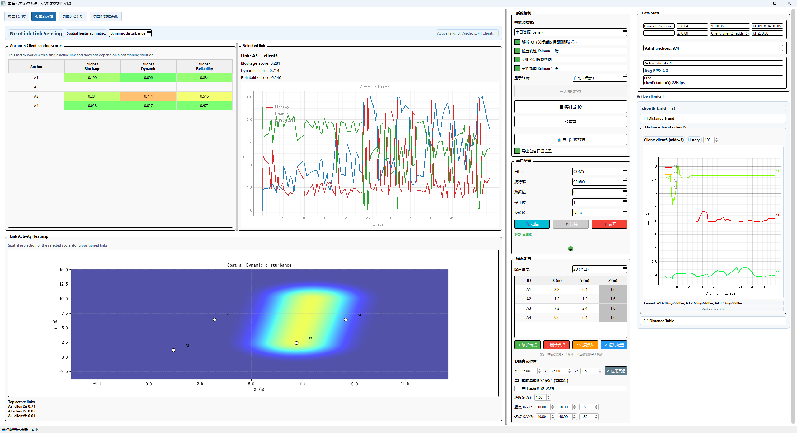
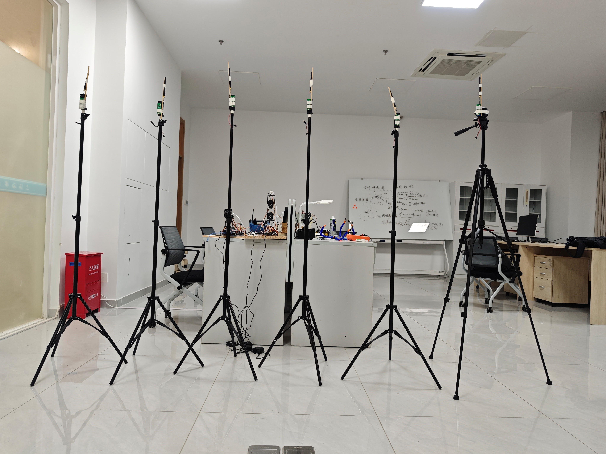
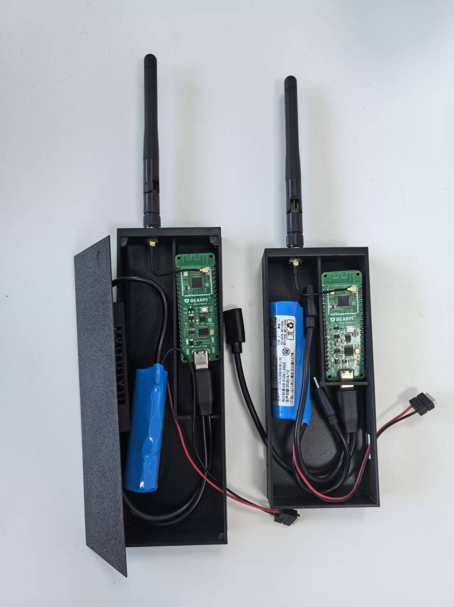

# NearLink UWB-Like Ranging & Positioning Suite

<p align="right">English | <a href="README.md">简体中文</a></p>

An end-to-end research suite for multi-anchor ranging, bidirectional IQ collection, positioning, and link sensing using NearLink SLE Channel Sounding.

> [!IMPORTANT]
> “UWB-Like” describes the multi-anchor ranging and positioning experience. This project uses **NearLink SLE Channel Sounding**. It is not a UWB implementation and does not implement the UWB protocol.

## Overview

This repository provides a reproducible experimental pipeline. The embedded devices handle ranging and IQ aggregation, while the desktop application handles acquisition, positioning, signal analysis, link sensing, labeling, and dataset export.

| Module | Capabilities |
| --- | --- |
| `firmware/sle_measure_dis` | Anchor, Ranging Client, and Collector firmware; multi-anchor ranging and bidirectional IQ acquisition |
| `host` | Serial ingestion, multi-client distance monitoring, 2D/3D positioning, IQ/CFR/MUSIC analysis, link sensing, and dataset export |
| `docs` | SDK integration and system architecture documentation |

<p align="center">
  
</p>

The Collector does not perform Channel Sounding. It aggregates experimental data and sends it over the serial port, reducing processing and logging pressure on the Ranging Client. See [System Architecture](docs/ARCHITECTURE.md) for the complete data flow.

## Highlights

- A Ranging Client can connect to multiple Anchors; the current firmware defaults to four.
- Multiple Ranging Clients are supported and identified by configurable device addresses.
- IQ data is collected at both the Ranging Client and Anchor sides.
- The Collector aggregates distance, RSSI, ToF, timestamps, and bidirectional IQ data.
- The number of Anchors in the desktop application is configurable, with four shown by default.
- 2D/3D positioning, trajectory visualization, and optional Kalman position smoothing.
- Bidirectional IQ pairing, CFR and phase analysis, and MUSIC multipath metrics.
- Link-level blockage, dynamic disturbance, and reliability scores with activity heatmaps.
- Research-oriented labels, collection progress tracking, and Raw/Feature/Temporal dataset exports.

## Application Screenshots

| Real-time multi-anchor positioning | Link sensing and spatial heatmap |
| --- | --- |
| [](docs/assets/gui-positioning.png) | [](docs/assets/gui-sensing.png) |

Click either image to view the full interface.

## Hardware and Field Tests

- Board: BearPi-Pico H2821E
- Antenna: external 3 dBi whip antenna instead of the onboard PCB antenna
- Environment: open, unobstructed line of sight
- Observed result: more than 100 meters of ranging distance while retaining the original SDK calibration values

These results were obtained with a specific board, antenna arrangement, and RF environment. They do not guarantee the same range with every hardware setup. Antenna placement, interference, obstruction, Anchor geometry, and calibration can all affect the results.

<p align="center">
  
  
</p>

<p align="center"><em>Multi-Anchor experimental deployment and BearPi-Pico H2821E handheld terminals</em></p>

## Field-Test Video

▶ **[Watch the NearLink UWB-Like Ranging field test on Bilibili](https://www.bilibili.com/video/BV11wYQ6BEQ1/)**

The video demonstrates the project in a real test environment. The hardware and RF conditions are described in the previous section.

## Getting Started

### 1. Integrate the firmware

Prepare a HiSpark/BS2X SDK and build environment compatible with the BearPi-Pico H2821E, then follow the [SDK Integration Guide](docs/SDK_INTEGRATION.md) to install the sample and configure its three roles.

- [Firmware Guide](firmware/sle_measure_dis/README.md)
- [Collector Serial and IQ Protocol](firmware/sle_measure_dis/PROTOCOL.md)

This repository intentionally excludes the complete vendor SDK, compiler, signing tools, and proprietary binary dependencies.

### 2. Run the host application

Python 3.10 or 3.11 is recommended.

```bash
cd host
python -m venv .venv
```

Activate the environment on Windows:

```powershell
.venv\Scripts\activate
```

Or on Linux/macOS:

```bash
source .venv/bin/activate
```

Install the dependencies and launch the application:

```bash
python -m pip install -r requirements.txt
python run_gui.py
```

See the [Host Application Guide](host/README.md) for the interface, data format, and operating instructions.

## Repository Layout

```text
nearlink-uwb-like-ranging/
├── firmware/
│   └── sle_measure_dis/   # Firmware sample for integration into the HiSpark/BS2X SDK
├── host/                  # Complete desktop research application
│   ├── gui/               # User interface, plotting, and research services
│   ├── tests/             # Parser, export, and dynamic-Anchor regression tests
│   ├── algorithm.py       # 2D/3D positioning algorithms
│   ├── parse_iq_raw.py    # Collector log and IQ decoder
│   └── run_gui.py         # Application entry point
└── docs/                  # System and SDK documentation
```

## Current Limitations

- Four Anchors were comparatively stable in hardware tests. Intermittent connectivity was observed with a fifth Anchor, so the firmware defaults to four. The host application does not impose this Anchor-count limit.
- The Ranging Client does not continuously print IQ data because heavy serial logging can block the system. IQ output is controlled by a Collector firmware build option.
- The current protocol uses hexadecimal text fragments for readability and serial debugging rather than maximum bandwidth efficiency.
- Link scores and heatmaps are research features and should not be treated as certified human-presence detection results.

## Roadmap

- [x] Multi-Anchor and multi-Ranging-Client measurements
- [x] Bidirectional IQ acquisition and Collector aggregation
- [x] 2D/3D positioning and real-time visualization
- [x] IQ/CFR/MUSIC analysis
- [x] Link activity and blockage sensing
- [x] Research data labeling and export
- [ ] Versioned binary transport with payload lengths and CRC protection
- [ ] Systematic evaluation across additional environments and antenna configurations

## License

New code in this repository is licensed under the [Apache License 2.0](LICENSE). Files derived from or modified from the upstream SDK retain their original copyright and license notices; see [NOTICE](NOTICE). Users remain responsible for complying with the licenses of the SDK, toolchain, and third-party dependencies.
